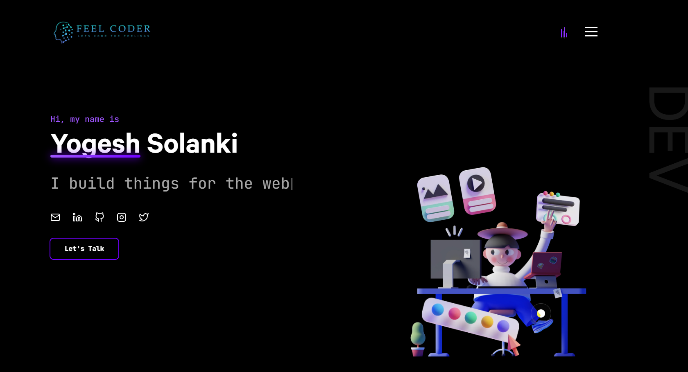

# Feelcoder

  
  
  

👨‍🎓 Built on NextJS, GSAP, Tailwind and React

### ✨ [Live Demo](https://feelcoder.vercel.app/)

## Getting Started

In the project directory, you can run:

#### `yarn install`

#### `yarn dev`

Runs the app in the development mode.\
Open [`http://localhost:3000`](http://localhost:3000) to view it in the browser.
